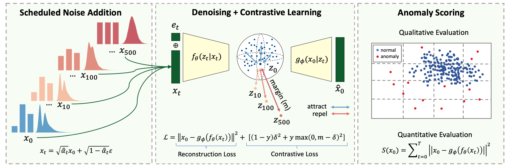

# 🧨 Diffusion-Scheduled Denoising Autoencoders for Anomaly Detection (AnoDDAE)

**Official implementation of the method presented in our KDD 2025 paper:** 

> **Diffusion-Scheduled Denoising Autoencoders for Anomaly Detection in Tabular Data** [Link]() (appears soon)

This repository provides reproducible implementation of the anomaly detection method based on a denoising autoencoder architecture with diffusion noise scheduling mechanism inspired by diffusion models.

> ⚠️ **Note:** This repository focuses on the methodology only. No pretrained models are released.

---

## 🌐 Project Overview

Our method improves anomaly detection in tabular data by:

1. **Methodology:** Introduction of the diffusion-scheduled denoising autoencoder (DDAE) that integrates diffusion noise scheduling into the denoising autoencoder framework.
2. **Representation:** Extension of DDAE using a contrastive learning objective (DDAE-C) that improves tabular data representations and anomaly detection performance.
3. **Evaluation**: Comprehensive evaluation of DDAE and DDAE-C, demonstrating their effectiveness in semi-supervised and unsupervised anomaly detection settings.
4. **Analysis**: In-depth analysis of the scheduled noise addition process, examining its impact on anomaly detection erformance across multiple noise protocols.

<p align="center">
  
</p>

---

## 📦 Features

- Sklearn like implementation with `fit()` / `predict()` interface
- Runs on ADBench benchmark tabular dataset
- Configurable via YAML
- Includes notebook demo for explanation and visualization
- Easy to extend or integrate into larger benchmarking pipelines

---

## 🚀 Quick Start

Install dependencies:
```bash
git clone https://github.com/sattarov/AnoDDAE.git
cd AnoDDAE
python -m venv venv
source venv/bin/activate
pip install -r requirements.txt
```

# Run experiment
```bash
python run.py --config configs/default.yaml
```

Try the interactive demo:
```bash
jupyter notebook notebooks/method_demo.ipynb
```


## 📁 Repository Structure
```markdown
├── run.py                 # Main script to run experiment
├── src/                   # Source code
│   ├── model.py           # Core method implementation
│   ├── data.py            # Dataset loader and pre-processing
│   ├── utils.py           # Utilities and metrics
│   ├── config.yaml        # Config files for experiments
├── notebooks/             # Jupyter demo notebooks
├── requirements.txt
└── README.md
```


## 📖 Citation

```bibtex
@inproceedings{...,
  title={Diffusion-Scheduled Denoising Autoencoders for Anomaly Detection in Tabular Data},
  author={Timur Sattarov, Marco Schreyer, and Damian Borth},
  booktitle={Proceedings of the 31 ACM SIGKDD Conference on Knowledge Discovery and Data Mining (KDD)},
  year={2025}
}
```

## 🙋‍♀️ Contact

For questions, feel free to reach out via [GitHub Issues](https://github.com/sattarov/AnoDDAE/issues).

---

### 🔧 To Do

- ...

---
